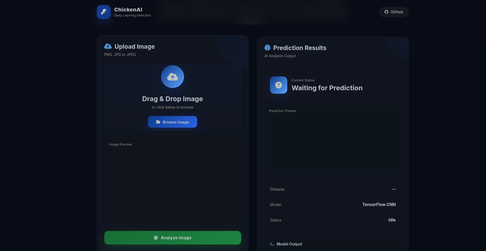
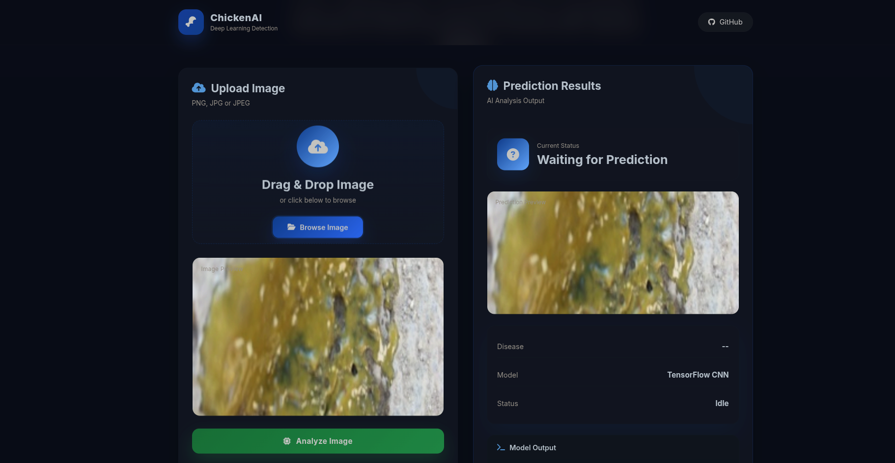
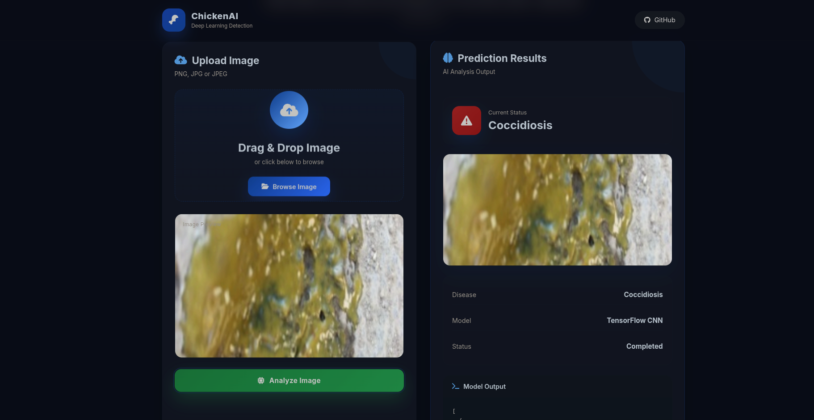
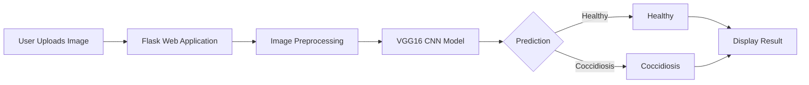
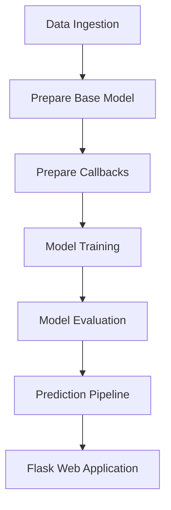

# 🐔 Chicken Disease Classification using Deep Learning

<p align="center">
  
</p>

<p align="center">
  
  
  
  
  
</p>

An end-to-end Deep Learning application that detects **Chicken Coccidiosis** from fecal images using **Transfer Learning (VGG16)**. The project includes a complete ML pipeline, Flask backend, responsive web interface, Docker support, and is ready for deployment on Render.

---

# ✨ Features

- 🧠 Transfer Learning with VGG16
- 📸 Chicken disease image classification
- 🌐 Responsive Flask web application
- 📦 Modular ML pipeline
- 📊 Model training & evaluation
- 🐳 Docker support
- ☁️ Render deployment ready
- ⚡ Optimized inference (model loaded once)

---

# 🖼 Application Preview

| Home | Upload | Prediction |
|:----:|:------:|:----------:|
|  |  |  |

---

# 🏗 System Architecture



---

# ⚙️ ML Pipeline



---

# 📁 Project Structure

```text
.
├── app.py
├── main.py
├── config/
├── src/
│   └── cnnClassifier/
│       ├── components/
│       ├── config/
│       ├── entity/
│       ├── pipeline/
│       └── utils/
├── templates/
├── static/
├── artifacts/
├── assets/
├── Dockerfile
├── docker-compose.yml
├── dvc.yaml
├── requirements.txt
└── README.md
```

---

# 🛠 Tech Stack

| Category | Technologies |
|-----------|--------------|
| Language | Python |
| Deep Learning | TensorFlow, Keras |
| Computer Vision | VGG16 Transfer Learning |
| Backend | Flask |
| Frontend | HTML, CSS, JavaScript |
| DevOps | Docker, DVC |
| Deployment | Render |

---

# 🚀 Installation

Clone the repository

```bash
git clone https://github.com/b14z31ng/Chiken_disease_class.git

cd Chiken_disease_class
```

Create a virtual environment

```bash
conda create -n chicken python=3.11 -y

conda activate chicken
```

Install dependencies

```bash
pip install -r requirements.txt
```

---

# 🏋️ Train the Model

```bash
python main.py
```

---

# ▶️ Run the Application

```bash
python app.py
```

Visit

```
http://localhost:8080
```

---

# 🐳 Docker

Build

```bash
docker build -t chicken-disease .
```

Run

```bash
docker compose up --build
```

---

# 📈 Model

- **Architecture:** VGG16 (Transfer Learning)
- **Framework:** TensorFlow / Keras
- **Classes:**
  - 🟢 Healthy
  - 🔴 Coccidiosis

---

# 🚀 Improvements

Compared to the original implementation, this project includes:

- Modern responsive UI
- Redesigned frontend
- Optimized prediction pipeline
- TensorFlow/Keras compatibility fixes
- Docker support
- Render deployment support
- Improved project organization
- Better user experience

---

# 🔮 Future Work

- Multi-class disease detection
- Confidence score visualization
- Batch prediction
- Explainable AI (Grad-CAM)
- MLflow integration
- CI/CD pipeline

---

# 🙏 Acknowledgement

This project is based on the educational implementation by **Krish Naik**. The project was independently rebuilt, configured, debugged, modernized, and extended with a redesigned frontend, Docker support, Render deployment readiness, and compatibility improvements for newer TensorFlow/Keras versions.

---

# 📄 License

Licensed under the MIT License.